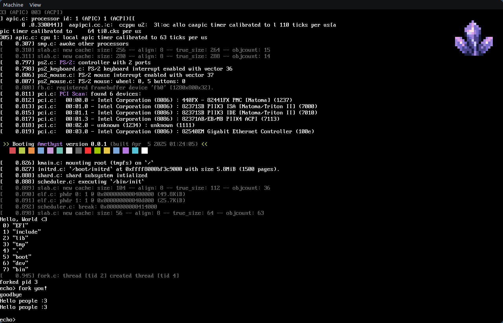

# Amethyst 

A UNIX-like OS with functional configuration and scripting support.

> [!IMPORTANT]
> This project is purely meant for educational purposes. There is no effort to produce production-ready code.
> Expect many features to be buggy, broken or even unimplemented.



## Overview

**This Project consists of three main pieces of software:**

### a) Amethyst - The Kernel

The Amethyst kernel is a UNIX-like monolithic kernel built completely from scratch in `C23` and `Assembly`.

This is the main part of this project. The code can be found in the `init/`, `kernel/`, `drivers/` and `include/` directories. Platform-specific code is located in the `arch/` directory.

**Features:**

- [x] Booting using the [limine](https://github.com/limine-bootloader/limine) boot loader
- [x] Paging, physical and virtual memory management
- [x] Kernel heap
- [x] UNIX-like VFS (including pseudo-filesystems like `devfs` (`/dev`) and `tmpfs` (`/tmp`))
- [ ] proper file systems like `FAT32`, `ext2`, ...
- [ ] NVMe driver
- [x] SMP-enabled preemptive multitasking and process management
- [x] Syscalls
- [x] Kernel stack switching
- [ ] User mode
- [x] PCI device identifictation & interaction
- [x] Keyboard input
- [ ] Mouse input
- [ ] ...

**Supported Architectures:**

- [x] `x86_64`
- [ ] `riscv64` (planned)

### b) Shard - A functional scripting language

Shard is a functional programming language designed for declarative builds and configuration of the Amethyst Operatiing system.

See [./shard](./shard) and [./shard/README.md](./shard/README.md) for more information.

### c) Geode - A declarative package manager based on Shard

Geode is the package manager and build system of the Amethyst Operating System.

See its source in [./shard/geode](./shard/geode) and the package store in [./store](store).

Features:

- [x] `bootstrap`: Build a new fully functioning system from a single configuration file *[in progress]*
- [ ] `rebuild`: Rebuild the system root on the go
- [ ] `update`: Pull store updates from the internet and do a full rebuild
- [ ] ...

> [!WARNING]
> `geode` is in especially early development state. Expect crashes and cryptic error messages.
## Building

### Build Dependencies:

- GNU binutils
- GNU make
- `gcc` version >= `13` (with `C23` support)
- `libarchive`
- `python3` (versions tested: `3.11` - `3.13`)

### Runtime Dependencies:

- `qemu`

### Getting an ISO

1. Clone this repository:

```console
$ git clone https://github.com/spydr06/amethyst --recursive
$ cd amethyst
```

2. Bootstrap the OS with the following command:

```console
$ tools/bootstrap.sh
```

> [!NOTE]
> When compiling for the first time, bootstrapping the system can take several minutes.
> 
> You can speed up the process by utilizing more cpu cores using the `-jN` flag.

### Running in a VM

To run amethyst in `qemu`, use either the `run` or `run-kvm` make targets in order to run with or without KVM enabled.

```console
$ tools/run.sh
```

or (with KVM):

```console
$ tools/run.sh -K
```

or (for debugging with `gdb`):

```console
$ tools/run.sh -d
```

## Contributing

Pull requests are welcome. For major changes, please open an issue first for discussion. Make sure to update unit tests as appropriate.

Please note that this is a *toy* OS. Hardware support and system stability are not guaranteed.

## License

Amethyst, Shard and Geode are licensed under the [MIT License](https://mit-license.org/). See [./LICENSE](./LICENSE) for more information.

The C standard library (`store/libc`) uses partially (e.g. `mallocng`) code from [musl libc](https://musl.libc.org/).
See musl's [COPYRIGHT](https://git.musl-libc.org/cgit/musl/tree/COPYRIGHT) file for more information.
I do not take credit for these segments of the code.

For all other parts (`pci.ids`, `limine`, `libarchive`, ...), their respective licenses apply. I take no credit at these projects.

## Resources | Reference | Inspiration

- [OSDev wiki](https://osdev.wiki/wiki/Expanded_Main_Page)
- [OSDev Discord server](https://discord.gg/RnCtsqD)
- [The Linux Kernel](https://kernel.org/)
- [Astral](https://github.com/Mathewnd/Astral/tree/rewrite)
- [SpecOS](https://github.com/UnmappedStack/SpecOS)
- [PotatOS](https://github.com/UnmappedStack/PotatOS)
- [AsbestOS](https://github.com/Spydr06/AsbestOS)
- ...

